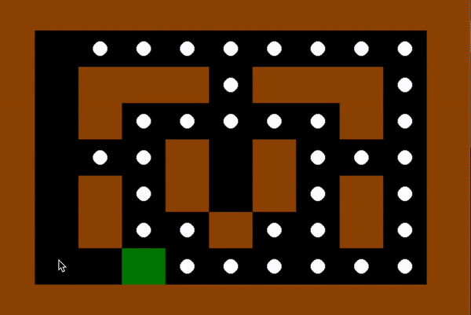

# The Pacman Game With Q-Learning Implementation

<p align="center">
  
</p>

This repository contains the implementation of the Pacman game using Q-learning as part of the Artificial Intelligence course at the University of Tehran.

## Project Overview

The goal of this project is to apply Q-learning to solve the Pacman game. The environment consists of Agents, Dots, Walls, and optionally Ghosts. The objective is to collect all the Dots without touching any Ghosts.

## Files

- `AI_HW01.ipynb`: Jupyter Notebook containing the implementation of the Pacman game using Q-learning.

## Requirements

- Python 3.x
- Jupyter Notebook
- NumPy
- Matplotlib

## Installation

1. Clone the repository:
   ```bash
   git clone https://github.com/MohaZamani/Pacman-Q-Learning.git
   ```
2. Navigate to the project directory:
   ```bash
   cd Pacman-Q-Learning
   ```
3. Install the required packages:
   ```bash
   pip3 install -r requirements.txt
   ```

## Usage

1. Open the Jupyter Notebook:
   ```bash
   jupyter notebook AI_HW01.ipynb
   ```
2. Run the cells in the notebook to see the implementation and results.

## Project Details

### Reward System & Q-learning

1. **Reward Modification**:

   - Discusses how a slight reward adjustment affects the optimal value function and policy.
   - Explores the impact of scaling all rewards by a constant and under what conditions the optimal policy remains unchanged.

2. **Pacman Implementation**:
   - **Environment Setup**: The environment includes Agents, Dots, Walls, and optionally Ghosts. The goal is to collect all Dots without touching any Ghosts.
   - **State and Action Definitions**: Define the states, actions, rewards, and goal state for the Pacman game.
   - **Parameter Analysis**: Analyze the effect of different gamma (γ) and alpha (α) values on the learning process.
   - **Graph Representation**: Represent the environment as a weighted graph and draw the Q-Table.
   - **Testing**: Test the code on different environments and report the results.

### Bonus Parts

- **Graphical Display**: Optionally, display episodes and rewards graphically.
- **Ghosts**: Adding ghosts to the environment for extra points.

## Results

- Analysis of the effect of different gamma (γ) and alpha (α) values.
- Q-Table representation.
- Performance on different environments.

## Contributing

Contributions are welcome! Please feel free to submit a Pull Request.

## Acknowledgments

- Dr. Sajedi, University of Tehran
- Pacman AI Projects by UC Berkeley
